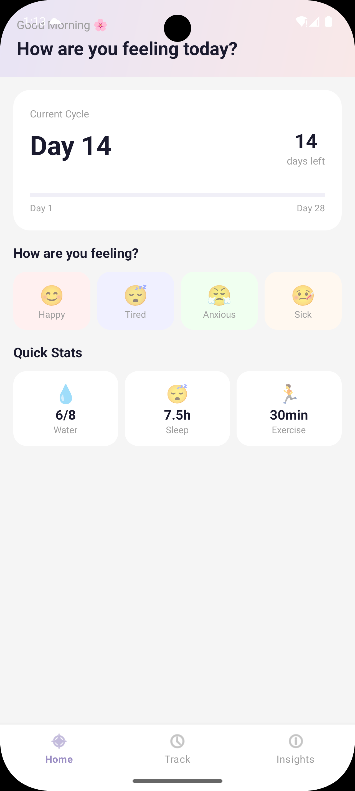
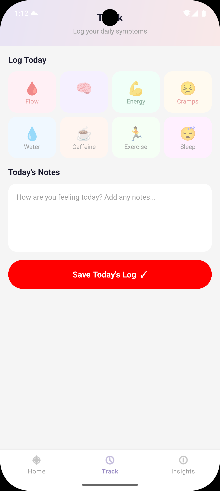
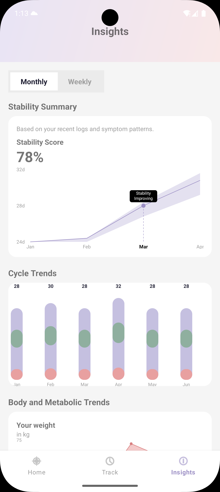
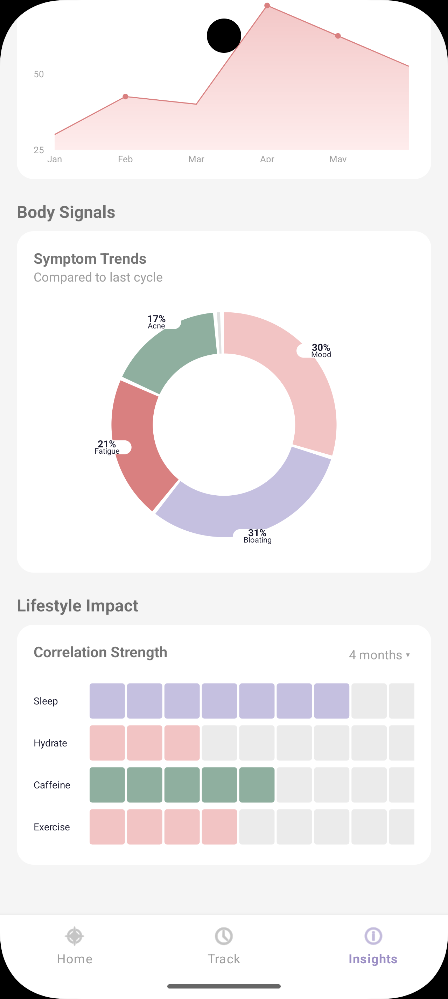
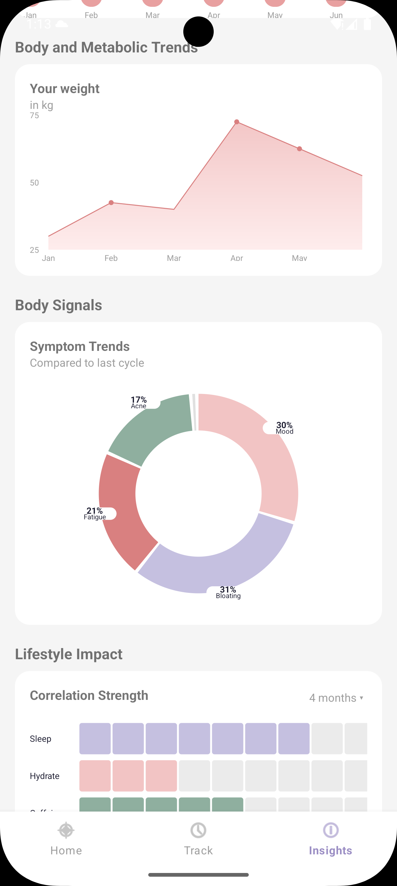

# 🌸 CycleApp — Menstrual Health Tracker

> A beautifully designed Android app for tracking menstrual cycles, symptoms, and health insights.

---

## 📱 Screenshots

> _Add your screenshots here — drag and drop images into this section on GitHub_

| Home | Track | Insights |
|------|-------|----------|
|  |  |  |

| Monthly Toggle | Weekly Toggle | Month Picker |
|----------------|---------------|--------------|
|  |  |

---

## ✨ Features

### 🏠 Home Screen
- Daily overview of cycle status
- Quick health summary cards
- Personalized greeting and next period prediction

### 📊 Insights Screen
- **Monthly / Weekly toggle** — Switch between monthly and weekly data views with animated selection state
- **Stability Summary** — Visual score chart showing cycle stability over time
- **Cycle Trends** — Bar chart comparing cycle lengths across 6 months
- **Body & Metabolic Trends** — Weight tracking chart with gradient fill
- **Body Signals / Donut Chart** — Symptom breakdown (Mood, Bloating, Fatigue, Acne)
- **Lifestyle Impact Grid** — Correlation strength for Sleep, Hydration, Caffeine, Exercise
- **Month Range Picker** — Tap "4 months ▾" to select 1–12 month range via dialog

### 📅 Track Screen
- Log daily symptoms, flow, and mood
- Quick-entry cards with visual feedback

### 🔘 Bottom Navigation
- Smooth fragment switching between Home, Track, Insights
- Selected tab highlighted in purple (`#9B8EC4`)
- Ripple effect on all nav items

---

## 🛠️ Tech Stack

| Layer | Technology |
|-------|-----------|
| Language | Kotlin |
| UI | XML Layouts + Custom Views |
| Architecture | Fragment-based with ViewModel |
| Charts | 100% Custom Canvas Drawing (no third-party chart lib) |
| Navigation | BottomNavigationView (Material Components) |
| Min SDK | API 24 (Android 7.0) |
| Target SDK | API 35 |

---

## 🎨 Custom Views

All charts are built from scratch using Android `Canvas` API:

| View | Description |
|------|-------------|
| `StabilityChartView` | Line chart with confidence band, tooltip, and dashed indicator |
| `CycleTrendsView` | Segmented bar chart with purple/green/red layers |
| `WeightChartView` | Area chart with gradient fill and dot markers |
| `DonutChartView` | Donut/ring chart with external percentage labels |
| `CorrelationGridView` | Grid heatmap showing lifestyle correlation strength |

---

## 🎨 Color Palette

| Name | Hex | Usage |
|------|-----|-------|
| Purple Primary | `#9B8EC4` | Charts, selected states |
| Purple Light | `#C5C0E0` | Chart bands, accents |
| Green Soft | `#8FAF9F` | Positive indicators |
| Red Soft | `#E8A0A0` | Flow, warnings |
| Dark Text | `#1A1A2E` | Primary text |
| Gray Text | `#9E9E9E` | Secondary text, labels |
| Background | `#F5F5F5` | App background |

---

## 🚀 Getting Started

### Prerequisites
- Android Studio Hedgehog or newer
- JDK 17+
- Android SDK API 35

### Installation

```bash
# Clone the repository
git clone https://github.com/yourusername/cycleapp.git

# Open in Android Studio
File → Open → select the cycleapp folder

# Build & Run
Click ▶ Run or press Shift + F10
```

### Dependencies

Add to `build.gradle (app)`:

```gradle
dependencies {
    implementation 'com.google.android.material:material:1.9.0'
    implementation 'androidx.cardview:cardview:1.0.0'
    implementation 'androidx.fragment:fragment-ktx:1.6.2'
}
```

---

## 📁 Project Structure

```
app/src/main/
├── java/com/vishal/cycleapp/
│   ├── MainActivity.kt                  # Bottom nav + fragment host
│   ├── ui/
│   │   ├── insights/
│   │   │   └── InsightsFragment.kt      # Toggle, dialog, chart logic
│   │   ├── home/
│   │   │   └── HomeFragment.kt
│   │   └── track/
│   │       └── TrackFragment.kt
│   └── custom_views/
│       ├── StabilityChartView.kt
│       ├── CycleTrendsView.kt
│       ├── WeightChartView.kt
│       ├── DonutChartView.kt
│       └── CorrelationGridView.kt
├── res/
│   ├── layout/
│   │   ├── activity_main.xml
│   │   ├── fragment_insights.xml
│   │   ├── fragment_home.xml
│   │   └── fragment_track.xml
│   ├── menu/
│   │   └── bottom_nav_menu.xml
│   ├── color/
│   │   └── nav_item_color.xml           # Purple/gray selector
│   └── values/
│       ├── colors.xml
│       ├── themes.xml
│       └── strings.xml
```

---

## 🔄 Interactive Elements

| Element | Interaction | Effect |
|---------|-------------|--------|
| Monthly Button | Tap | White bg, dark text — score updates to 78% |
| Weekly Button | Tap | White bg, dark text — score updates to 65% |
| "4 months ▾" | Tap | AlertDialog with 6 range options |
| Bottom Nav | Tap | Fragment switch + purple highlight |
| All buttons | Touch | Material ripple effect |

---

## 📸 How to Add Screenshots

1. Run app on emulator or device
2. Take screenshots using `Ctrl + S` in emulator or Android Studio's screenshot tool
3. Create a `screenshots/` folder in root of repo
4. Add images named: `home.png`, `track.png`, `insights.png`, `monthly.png`, `weekly.png`, `picker.png`

---

## 👨‍💻 Author

**Vishal**
- GitHub: [@vishal](https://github.com/Vishal01z/)

---

## 📄 License

```
MIT License — feel free to use, modify, and distribute.
```

---

<p align="center">Made with ❤️ using Kotlin + Canvas API</p>
